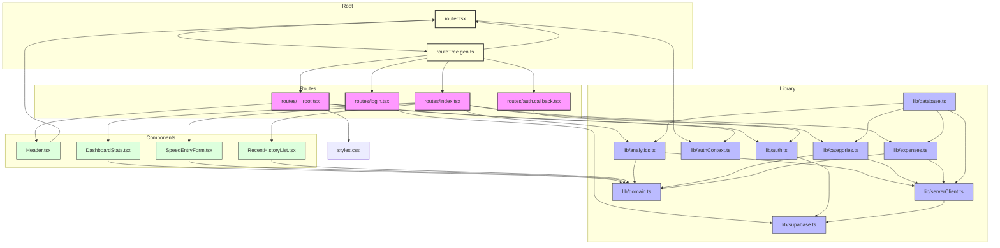

# Dependency Flowchart

This flowchart visualizes the internal dependencies within the `src` directory of the MinimaSpend application.

## Key Observations

1.  **Core Domain**: `lib/domain.ts` is the foundational layer, providing types for almost all other parts of the system.
2.  **Supabase Orchestration**: `lib/supabase.ts` and `lib/serverClient.ts` handle the connection to the backend, with `serverClient` being used by domain-specific library functions.
3.  **Route Integration**: The routes in `src/routes` act as the main integration point, combining UI components with library logic.
4.  **TanStack Router**: The application uses TanStack Router with a generated `routeTree`, which creates a central hub for navigation and routing logic.
